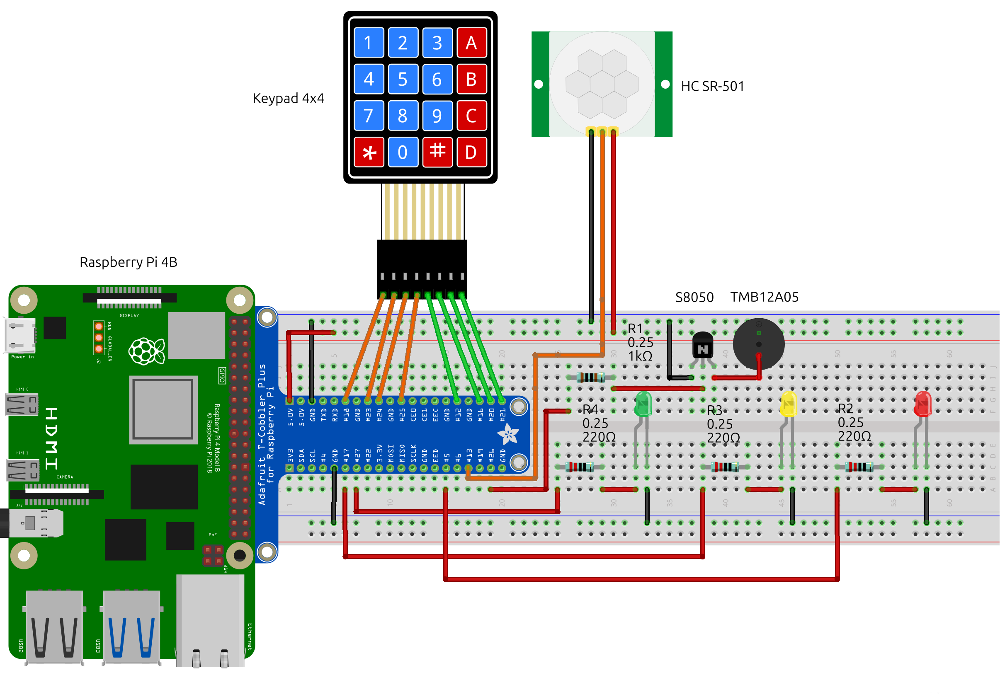
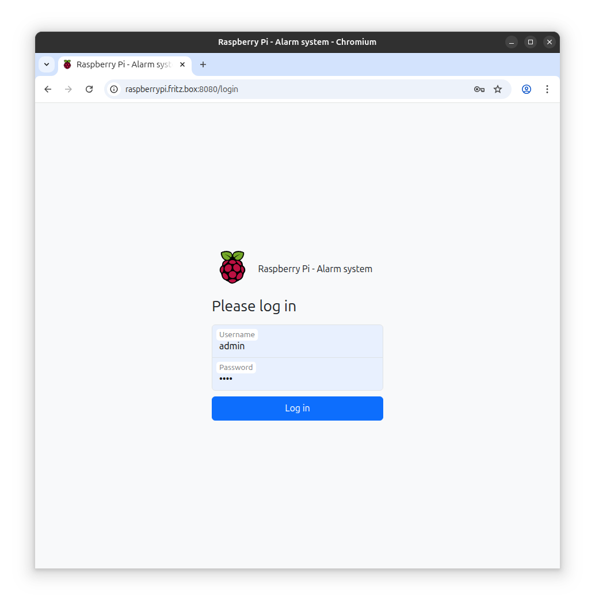
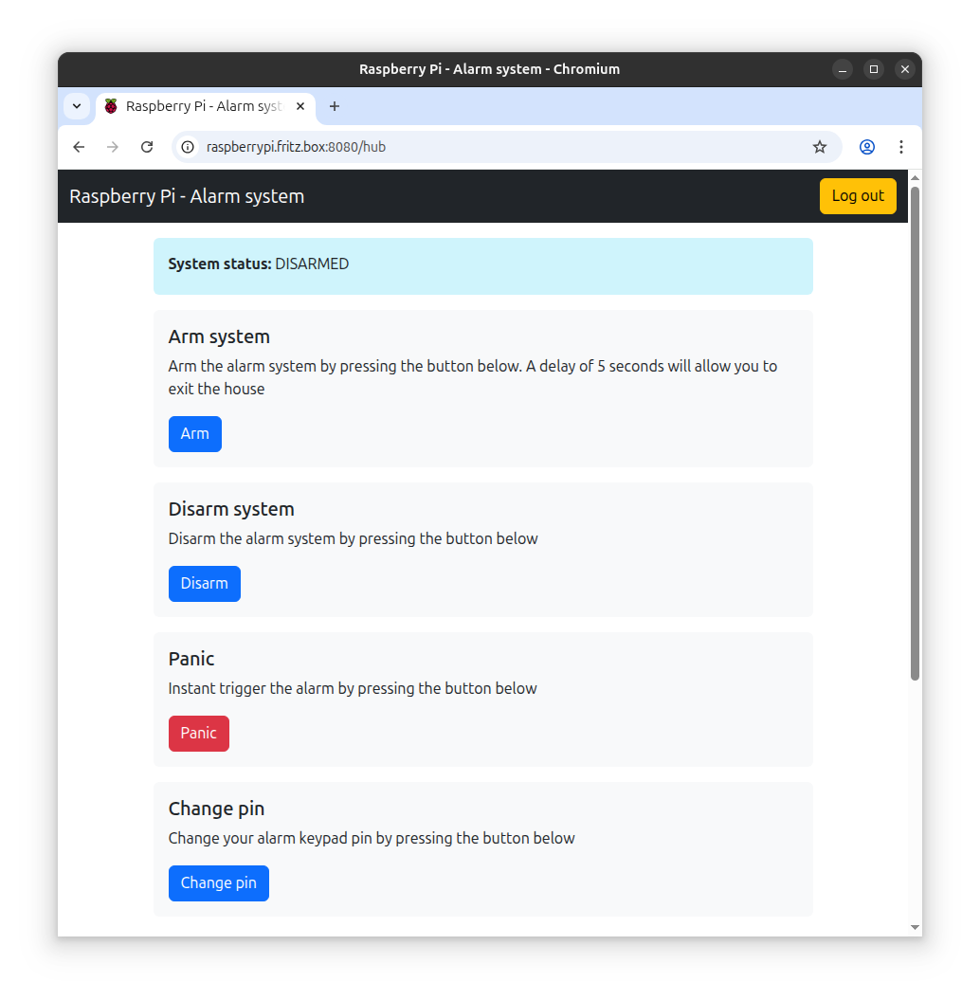

Spring Boot - Raspberry Pi - Alarm system
--


### Description
This project is an example of using Spring Boot with Raspberry Pi 4 and PI4J to create a simple wired alarm system. <br/>
The advantage of using Java is that it provides a mature multithreading library and the powerful spring boot framework that makes this simple project versatile as it can be used both offline via the provided keypad or remote via a web browser.<br/>
(Demo video provided at the end of this file)<br/>

### Hardware
#### Breadboard connections


#### Bill of materials (BOM)
* 1 x Raspberry Pi 4B (With official Raspberry PI OS Full 64bit installed)
* 1 x GPIO Extension Board with 40pin ribbon cable
* 1 x Membrane keypad 4x4
* 1 x HC SR501 PIR sensor
* 1 x TMB12A05 active buzzer
* 1 x S8050 generic NPN transistor
* 3 x 220&#937; 0.25W resistor
* 1 x 1K&#937; 0.25W resistor
* 3 x LED different colours
* 1 x Breadboard
* 25 x Jumper wires

### Software
#### Frontend
Web interface is designed using Thymeleaf views and Bootstrap that runs on top of the embedded spring-boot's Tomcat server and Spring MVC<br/> 
After connecting you RPI to your local network, access the board using  a web browser with the URL:
```
http://raspberrypi.[your-localrouter-dns]:8080/login
E.g. for a fritzbox router: http://raspberrypi.fritz.box:8080/login 
E.g. when running in local: http://localhost:8080/login
```
> [!TIP]
> Login credentials: admin/test<br/>
> Login credentials and other useful parameters for the alarm can be found and changed in ./springboot-rpi-alarm-system/src/main/resources/application.properties



#### Backend
The alarm system is based on a non-blocking Finite State Machine, meaning each state runs in its own thread allowing the web interface to not block while waiting for different operations.<br/>
Multi-threaded reusable java drivers for RPI are implemented using PI4J library for Keypad, PIR, LED and Buzzer.<br/>
Keypad driver includes debounce implementation also. 

#### Operation
For the web interface you just log in and press the buttons for operation that you want. E.g., Arm the alarm system. A feedback message is provided if the operation was successful or not.<br/>
"Change pin" button allows you to actively change the pin that will be used by the keyboard to disarm the system."Disarm" button does not need any pin to disarm.<br/>
"System status" field is updated automatically every 2.5 seconds via an Ajax call.

Keyboard operation consists on 2 command:
* Pressing key "A" will start the countdown with a duration configured in application.properties and then arm the system. At this point a body detected by the PIR sensor will trigger the alarm and activate the buzzer.<br/>
* If an alarm triggered, to disarm the system press the following keys: D[PIN] E.g., default config keys: D1234<br/>

LED description:
* Green LED means the alarm system software was started correctly and runs on your RPI board
* Yellow LED will provide feedback each time a key is presses on the keypad by blinking 200ms. It also blinks during countdown.
* Red LED will blink when alarm system is triggered along with the buzzer beeping. 

> [!TIP]
> Any combination of commands from the web or keypad will work. E.g., arm via web and disarm via keypad<br/>

### Usage
Requires JDK 17<br/>
To run the project on your local computer without a RPI board use the following command:<br/>
```
./gradlew bootJar && java -jar build/libs/springboot-rpi-alarm-system-1.0.jar
```
To run the tests use the following gradle task:<br/>
```
./gradlew clean test
```
The latest Raspberry Pi OS should have Java 17+ already installed<br/>
To run the project on your RPI board, download the jar file from the previous command and use the following:<br/>
```
java -jar springboot-rpi-alarm-system-1.0.jar
less +F alarm.log 
```

### Demo video
TBD 

> [!TIP]
> Health-check for alarm system can be accessed via: http://raspberrypi.fritz.box:8080/actuator/health/application<br/>
> In case any probe will need to check if the application is alive this endpoint will return an HTTP 200 OK: http://raspberrypi.fritz.box:8080/actuator/info<br/>

> [!TIP]
> I case you have older JDK version than JDK 17 and you are using IntelliJIDEA as IDE make sure Gradle JVM is set to JDK 17 in:<br/>
> File | Settings | Build, Execution, Deployment | Build Tools | Gradle  -> Gradle JVM
